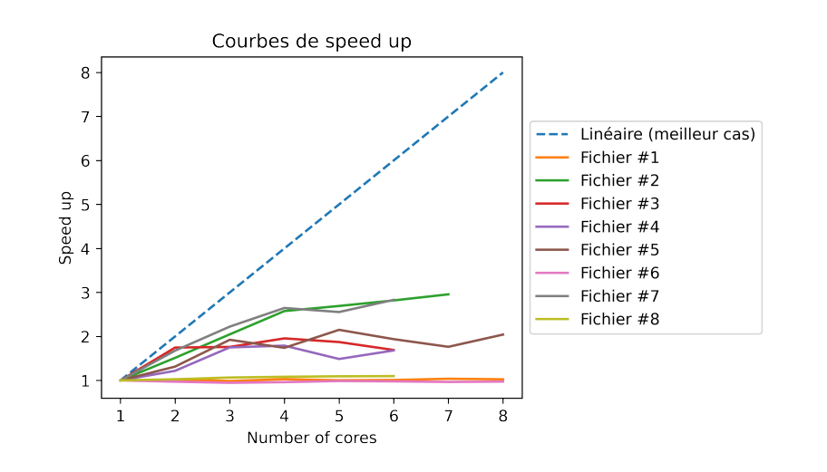

# Nombres-premiers-pthread
Ce programme a été réalisé pour un TP à l'Université Laval. Il consiste à trouver les nombres premiers dans une liste d'intervalle en s'exécutant sur le nombre de coeurs précisé.

## Performances 

